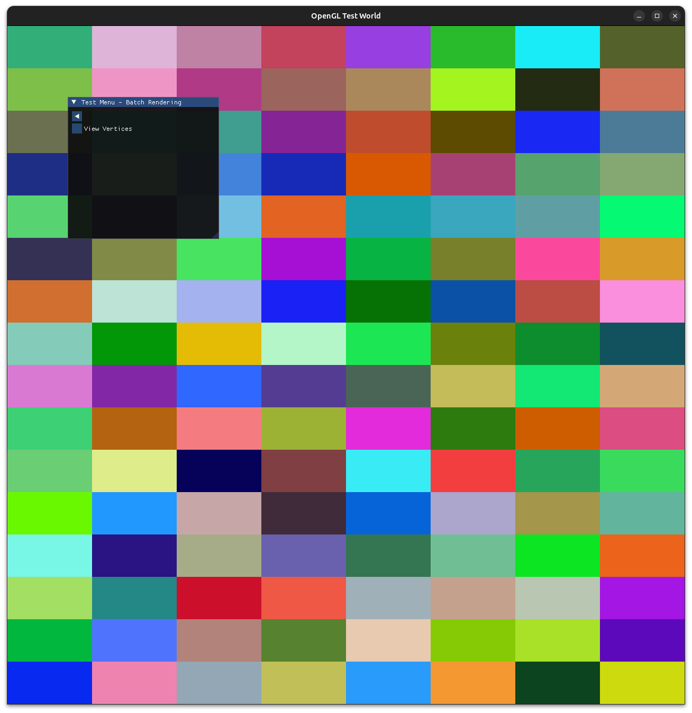
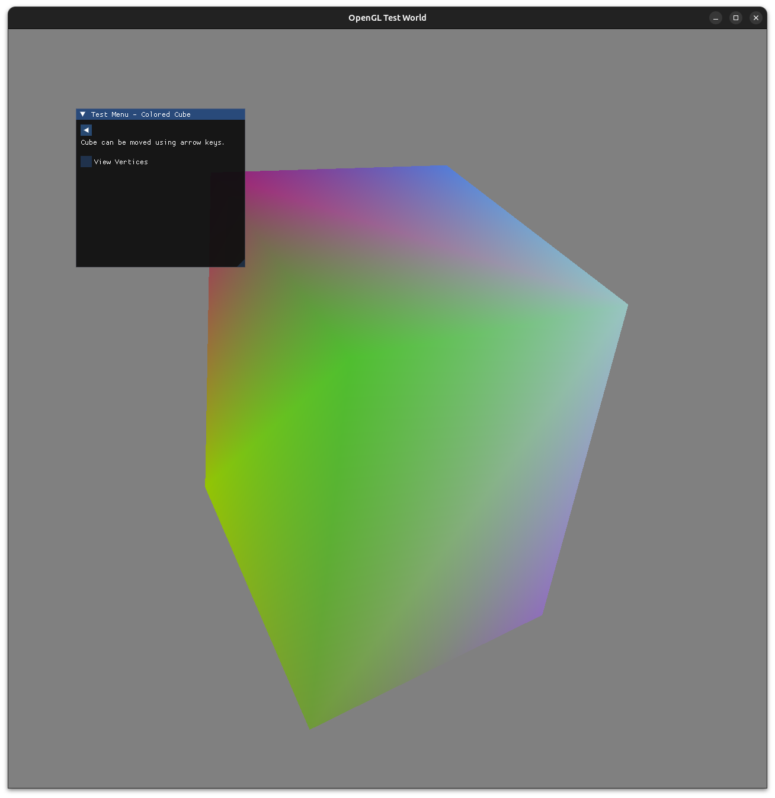
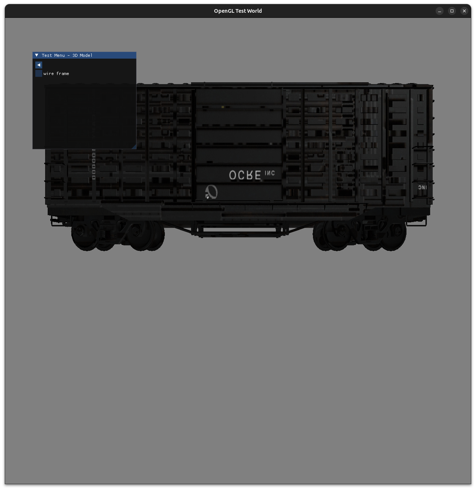
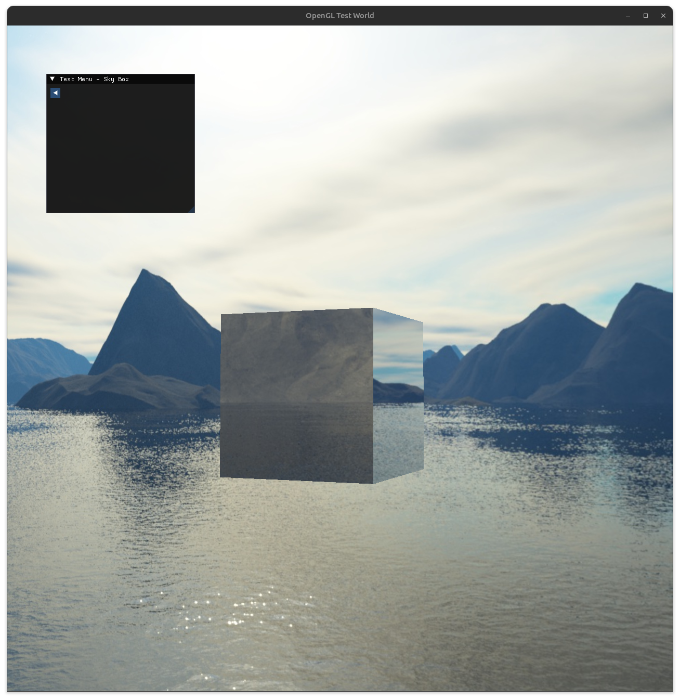

# OpenGL Test 
Graphical showcase of OpenGL using C++ for use as a reference.

## Details
Desktop application demonstrating OpenGL examples, using c++-20 and cmake version (2.25.0)+.
Different examples are shown in an ImGui window showcasing use of OpenGL from 2D to 3D.

    
    

    
    

## Libraries
* [GLEW][hl_glew]
* [GLFW][hl_glfw] (for windowing)
* [ImGUI][hl_imgui] (testing)
* [GLM][hl_glm] (math operations for rendering)
* [stb/stb_image.h][hl_stb] (image loader for textures)

[hl_glew]: https://glew.sourceforge.net/
[hl_glfw]: https://www.glfw.org/
[hl_imgui]: https://github.com/ocornut/imgui
[hl_glm]: https://github.com/g-truc/glm
[hl_stb]: https://github.com/nothings/stb/blob/master/stb_image.h
